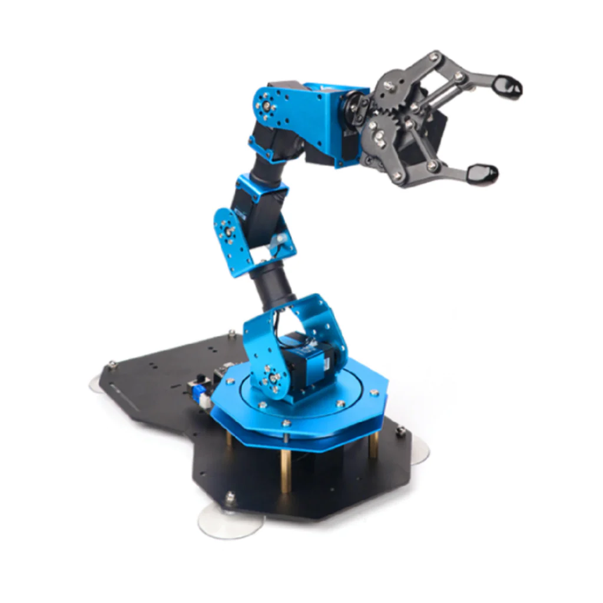
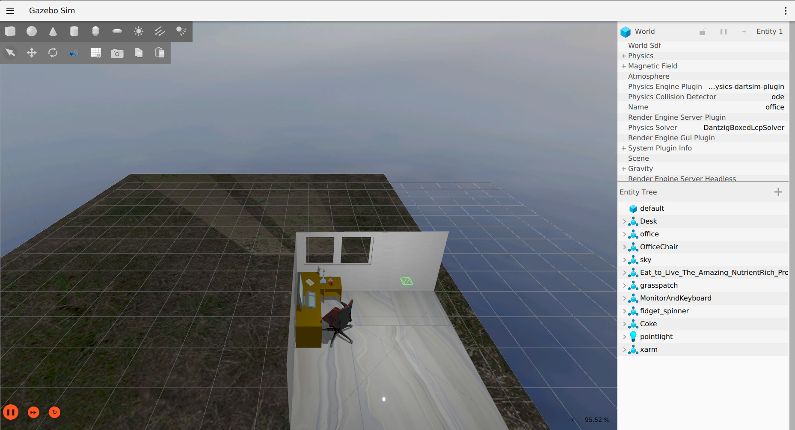
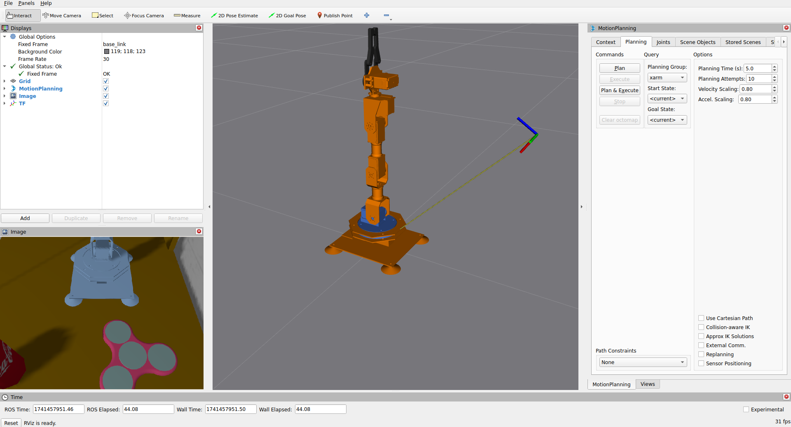
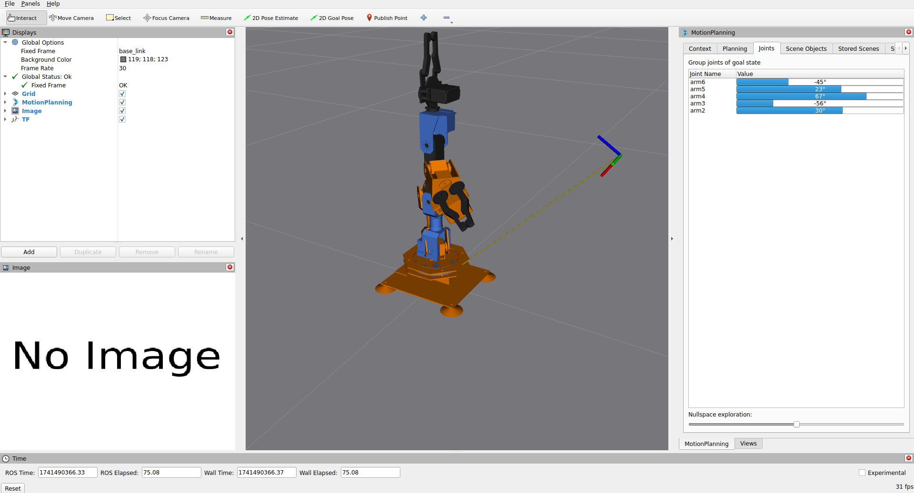

# xArm ESP32 ROS2 packages



This repo contains packages to simulate and control an xArm robot arm by Hiwonder in ROS 2 Jazzy and Gazebo Harmonic.

The robot description was taken from allProgramming's [ros2_xarm_1s_demos](https://github.com/allProgramming/ros2_xarm_1s_demos/tree/main?tab=readme-ov-file) repo on Github.

## Current project content

* **xarm_bringup**: Real robot bringup package.
* **xarm_control**: ros2_control and serial communication package.
* **xarm_description**: Robot description package with URDF and mesh files.
* **xarm_gazebo**: Gazebo harmonic simulation package.
* **xarm_moveit_config**: MoveIt configuration package with move_group launch and ros2_control files.

## Installation

### Docker

To install docker the official script can be used for convenience:

```bash
>> curl -fsSL https://get.docker.com -o get-docker.sh
>> sudo sh ./get-docker.sh
>> sudo groupadd docker
>> sudo usermod -aG docker $USER
```

After this steps it is needed to logout and login again or just reboot the computer for the changes to take effect. to test the installation works properly use the command bellow

```bash
>> docker run hello-world
```

### Clone the repository

Follow the steps bellow to download the code on your local machine.

First create a workspace in case we want to run the code locally

```bash
>> mkdir -p xarm_ws/src
```

Clone the repository

```bash
>> cd xarm_ws/src
>> git clone https://github.com/DiegoCarvajal98/xarm_ros2.git
```

## Build the docker images

To run the simulation using docker first the images have to be built, for that run the following command

```bash
>> docker compose build
```

## Running the simulation

To run the gazebo simulation, run the sim image with the following command

```bash
>> docker compose up sim 
```

This command should open the Gazebo simulation shown bellow



And should open the RViz window to control the robot



## Real robot control

To control the real xArm robot run the "real" docker image with the following command

```bash
>> docker compose up real
```

This should open activate the controllers and open the RViz window to control the robot



